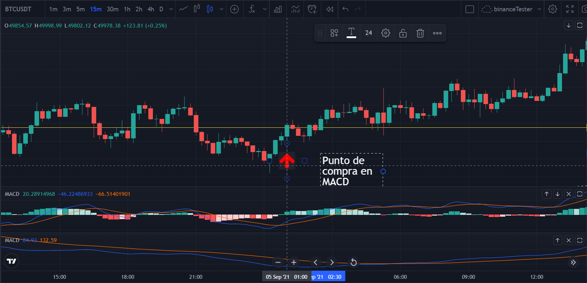
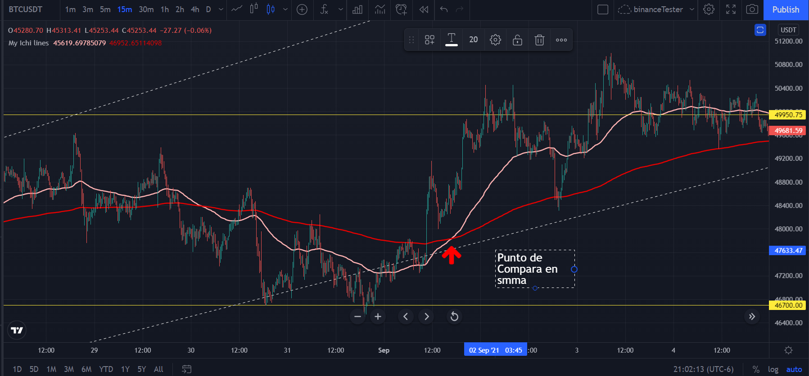
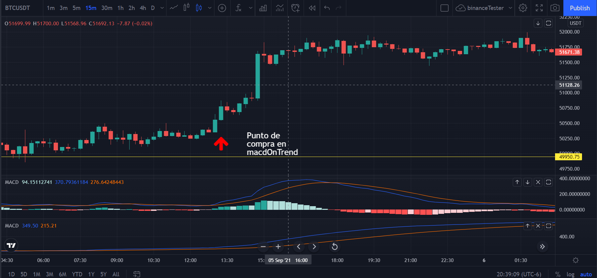
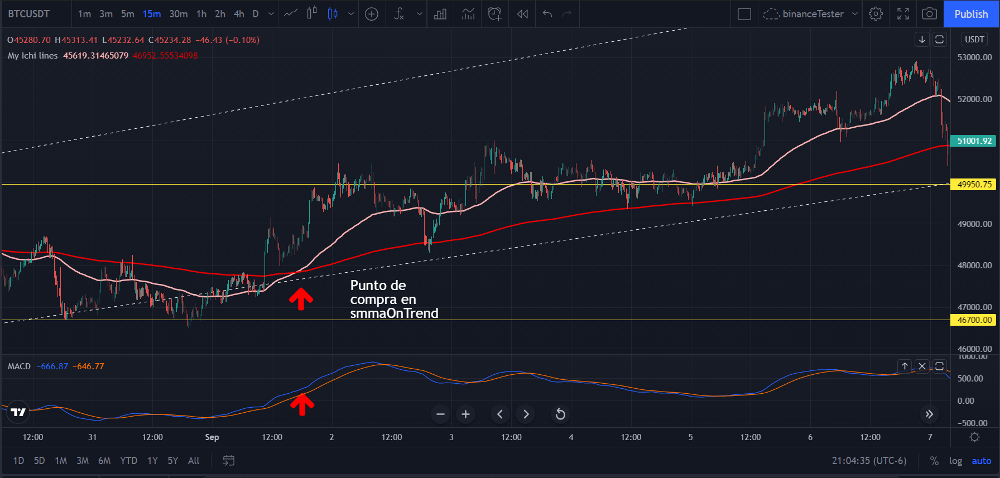
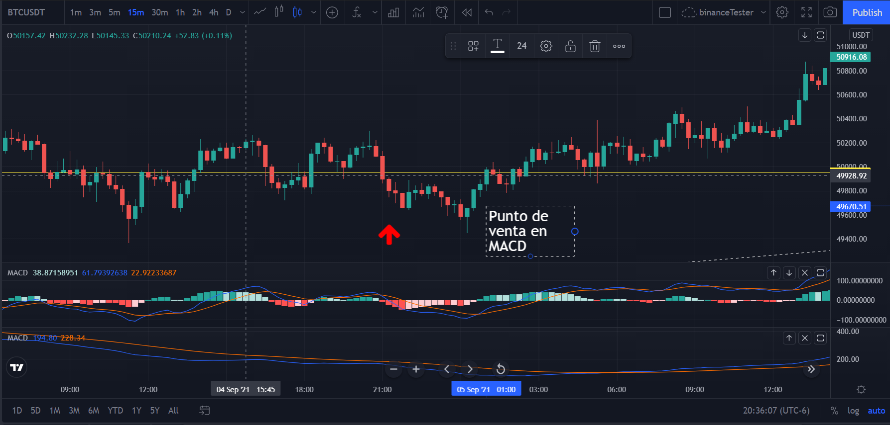
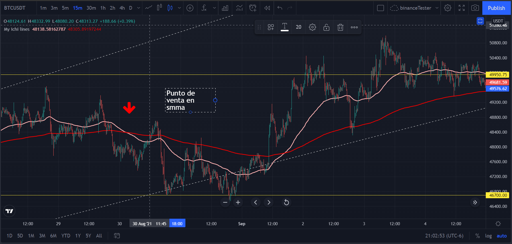
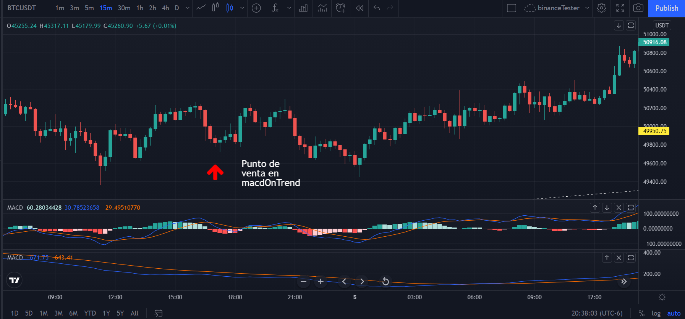
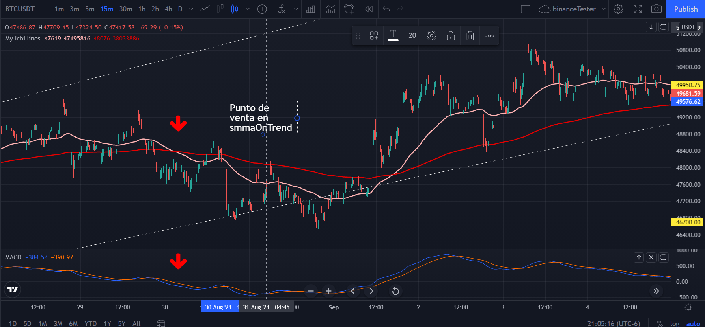

Bit Alert
=====

.. _Installation:

Installation
------------

To  use the software you will have to download the latest version :

* `<https://sistemasintegradosao.com/bregDist/>`_
* Choose your Operating system

BREK
----------------

Is a software that allows to Auto Trade and Manual trade on Binance platform ,
using indicators well known around the trading world, users can also trade,
with custom made indicators that Will be described later, some of these indicators
are:

* MACD
* ICHIMUKO CLOUD
* SMA
* EMA
* STOCHASTIC RSI
* AND MANY OTHERS

Users
----------------

Users can use the software for free for period of 30 days

+----------------------------------------------+
| User can                                     |
+==============================================+
| Use all system capabilities                  |
+----------------------------------------------+
| Auto Trade                                  |
+----------------------------------------------+
| Manual Trade                                 |
+----------------------------------------------+
| Trade Spot                                   |
+----------------------------------------------+
| Trade Margin Isolated                        |
+----------------------------------------------+

Fee
----------------

The fee is 0.05% per transaction and is calculated on USDT

Formula:

Total amount acquire * 0.05% when the base asset is USDT

Total (amount acquire * base asset price) * 0.05% when the base asset is anyother

The system
----------------

The system is extremely frank and self explanatory.

* Auto Trading

The system will display all the trading markets in the autotrading list,
and will start trading, automatically.

* Manual Trading

The system will SELL or BUY based on a single click of yours.
* SELECT MARKET
* CLICK ACTION (SELL OR BUY)
* as simple as that

Adjusting market settings
----------------

You must have a basic understanding of trading to use this software: One of the best tools
nowadays is : tradingview

1. please visit  `<https://www.tradingview.com/gopro/?share_your_love=eggstebantrader>`_  this will help you visualize your strategies.
2. create a free account.
3. start by adding (MACD) to your graph, then change its values, so that you can see how the graph changes.

After getting familiarized with indicators you can start BREK and add all the markets you want to trade on, and then modify its strategy

Strategies with standar indicators
----------------

**BUY Entry Points**

1. MACD - When the second bar on the positive side starts

2. SMMA -

3. macdOnTrend - When the second bar on the positive side starts and there is a up trend

4. smmaOnTrend - When the short line crosses over the long line and there is a up trend

**SELL Entry Points**

1. macd - When the second bar on the negative side starts

2. smma - When the short line under the long line

3. macdOnTrend - When the second bar on the negative side starts and there is a down trend

4. smmaOnTrend - When the short line crosses under the long line and there is a down trend

